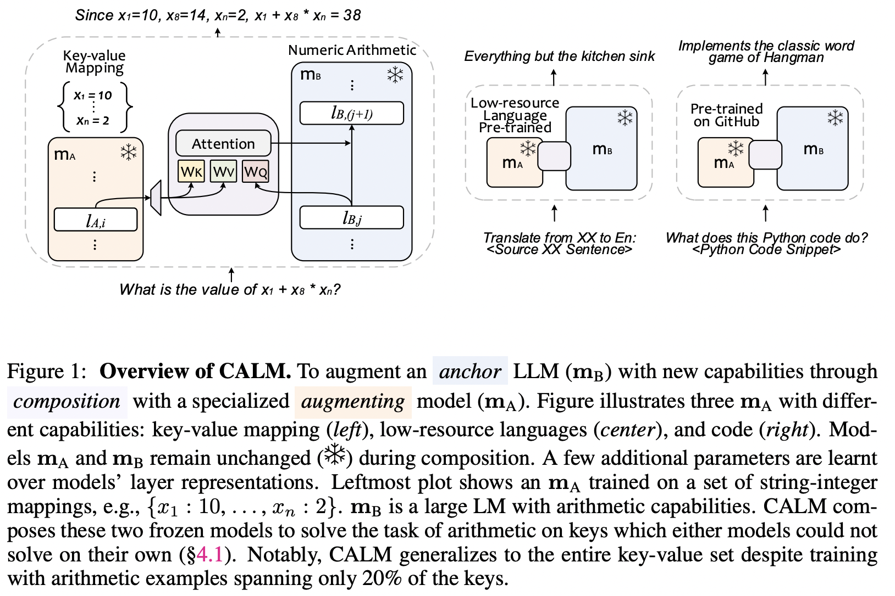

## CALM - Pytorch (wip)

Implementation of CALM from the paper <a href="https://arxiv.org/abs/2401.02412">LLM Augmented LLMs: Expanding Capabilities through Composition</a>, out of Google Deepmind

Will attempt to generalize this to any number of LLMs

<a href="https://discord.gg/Vmm5nrMZWc">Temporary discord discussion</a>

## Install

```bash
$ pip install CALM-pytorch
```

## Appreciation

- <a href="https://a16z.com/supporting-the-open-source-ai-community/">A16Z Open Source AI Grant Program</a> and <a href="https://huggingface.co/">🤗 Huggingface</a> for the generous sponsorships, as well as my other sponsors, for affording me the independence to open source current artificial intelligence research

## Usage

ex. with `x-transformers`

```python
import torch
from x_transformers import TransformerWrapper, Decoder

augment_llm = TransformerWrapper(
    num_tokens = 20000,
    max_seq_len = 1024,
    attn_layers = Decoder(
        dim = 512,
        depth = 12,
        heads = 8
    )
)

anchor_llm = TransformerWrapper(
    num_tokens = 20000,
    max_seq_len = 1024,
    attn_layers = Decoder(
        dim = 512,
        depth = 2,
        heads = 8
    )
)

from CALM_pytorch import CALM

wrapper = CALM(
  dim_anchor = 512,
  dim_augment = 512,
  anchor_llm = anchor_llm,
  augment_llm = augment_llm
)

seq = torch.randint(0, 20000, (1, 1024))

loss = wrapper(seq)
loss.backward()
```

## Todo

- [ ] auto-derive model dimensions with dummy input
- [ ] figure out how to correctly mask augment llm tokens
- [ ] take care of finetuning training logic
- [ ] allow for custom function for returning transformer blocks from llm module

## Citations

```bibtex
@inproceedings{Bansal2024LLMAL,
  title   = {LLM Augmented LLMs: Expanding Capabilities through Composition},
  author  = {Rachit Bansal and Bidisha Samanta and Siddharth Dalmia and Nitish Gupta and Shikhar Vashishth and Sriram Ganapathy and Abhishek Bapna and Prateek Jain and Partha Pratim Talukdar},
  year    = {2024},
  url     = {https://api.semanticscholar.org/CorpusID:266755751}
}
```
